# Measure It to Cure It

**Find where a new measurement for an invisible illness should launch first: the counties, clinics and clinicians
where it would make the most patients visible.** A public-data engine (alpha) for Long COVID, ME/CFS, POTS and related
conditions, with an agent that takes your own device or omics dataset and returns candidate launch sites.

**[Open the dashboard](dashboard.html)** (one HTML file, no install, no data needed) ·
[Final report](results/FINAL_REPORT.md) · [Walkthrough](docs/WALKTHROUGH.md) · [Launch agent](docs/LAUNCH_AGENT.md) ·
[Bring your own data](docs/BRING_YOUR_OWN_DATA.md)

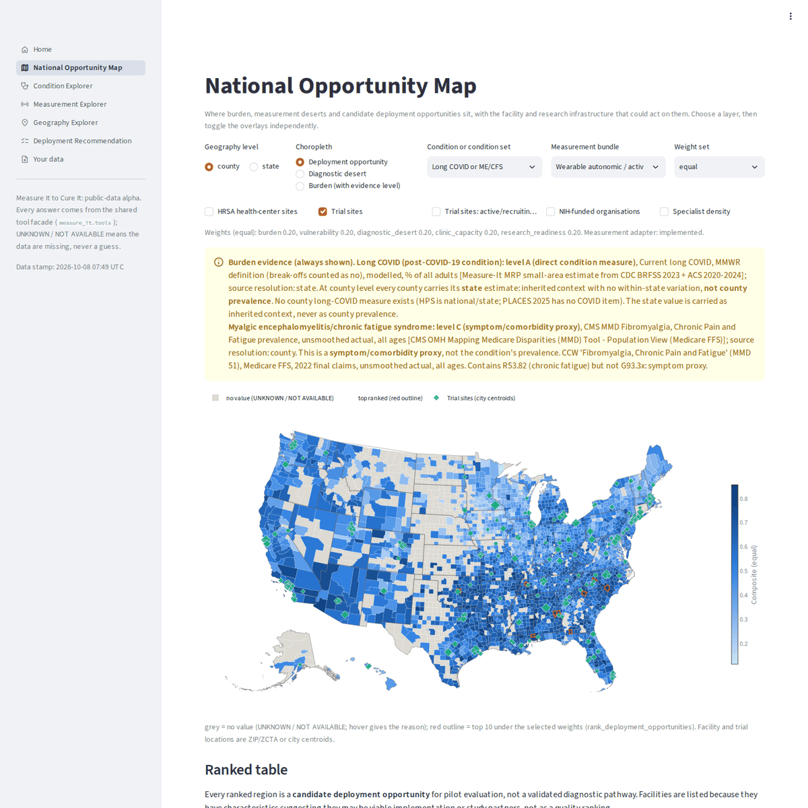

## What it does

The engine asks, for an invisible illness (Long COVID, ME/CFS, POTS/dysautonomia and related conditions) and a candidate
objective measurement: *what could make the phenotype measurable, where in the United States would deploying the
measurement be most useful, and which clinics or research sites could plausibly take part?* It chains public data
through

person-level wearable phenotype -> disease ontology -> condition-level molecular context -> candidate measurement
technology -> geographic burden and unmet need -> clinic and research-site readiness -> **candidate deployment
opportunity**,

keeps every score's components, and traces every recommendation back to source rows and raw files. You can run it on
the 40 public sources it ships modules for, or plug in your own measurements
([docs/BRING_YOUR_OWN_DATA.md](docs/BRING_YOUR_OWN_DATA.md)).

**It is not** a disease prevalence map, a wearable classifier, a provider directory or a medical chatbot. It does not
assess individuals, rank clinics by quality, infer where any participant lives, or attach omics to wearable
participants. A ranked region is a candidate for pilot evaluation, not a validated diagnostic pathway. Nothing here is
medical advice or a medical device.

| you have | run | you get |
|---|---|---|
| a device or omics dataset in almost any format (REDCap, CSV, Excel, SAS, OMOP, FHIR, ...) | `measure-it launch run <file> --condition long_covid --measurement <device>` | a reviewed mapping to standard codes, an All of Us-shaped OMOP export, and ranked launch counties with the clinics and clinicians to contact ([docs/LAUNCH_AGENT.md](docs/LAUNCH_AGENT.md)) |
| a question | `measure-it ask "Where should we deploy autonomic testing for POTS?"` | a cited answer from the ranked tables (no language model) |
| the built data | `measure-it dashboard`, `serve-api`, `serve-mcp` | the interactive dashboard, an HTTP API, and tools for Claude and other MCP clients |

## Visuals

| | |
|---|---|
| **[dashboard.html](dashboard.html)**: the read-only snapshot (ranked counties, county map, top-10 evidence cards, measurement performance, validation, limitations). Download and open it in any browser, or publish it with the manual *Dashboard on GitHub Pages* workflow. Every number was read from the tables when it was built. | [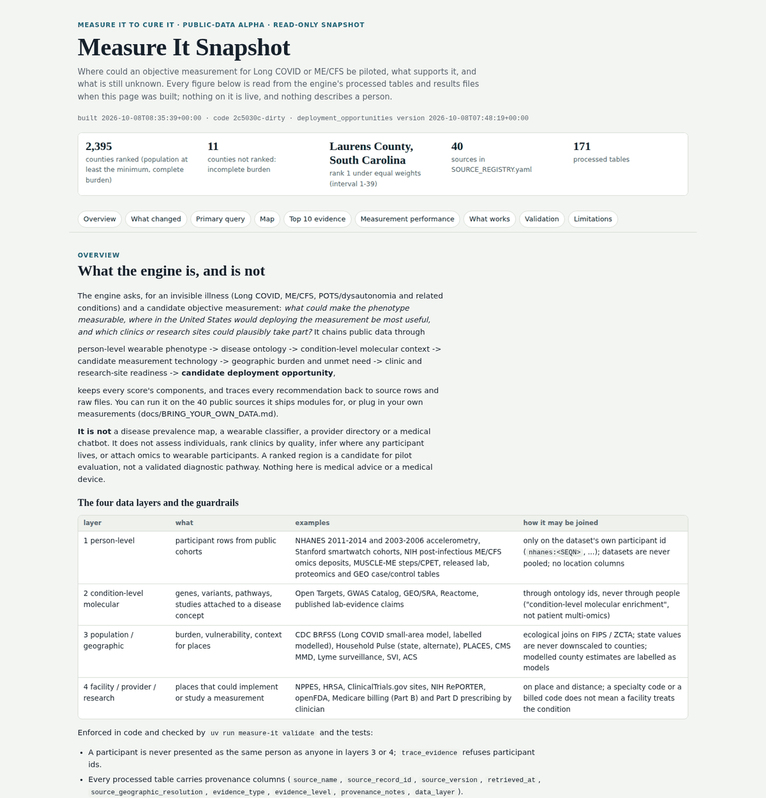](dashboard.html) |

**Interactive dashboard** (Streamlit, `uv run measure-it dashboard`, needs the built data):

| Home | Condition Explorer | Measurement Explorer |
|---|---|---|
| 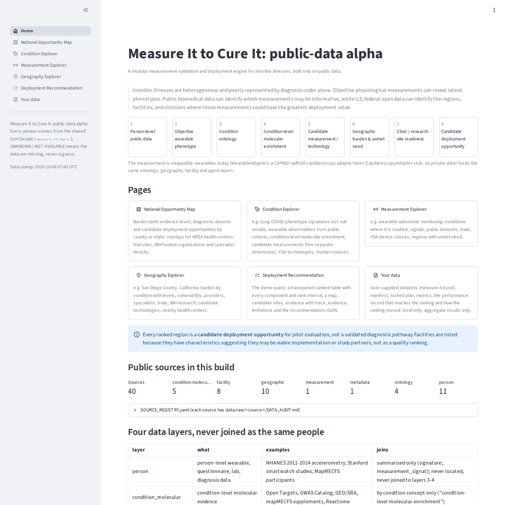 | 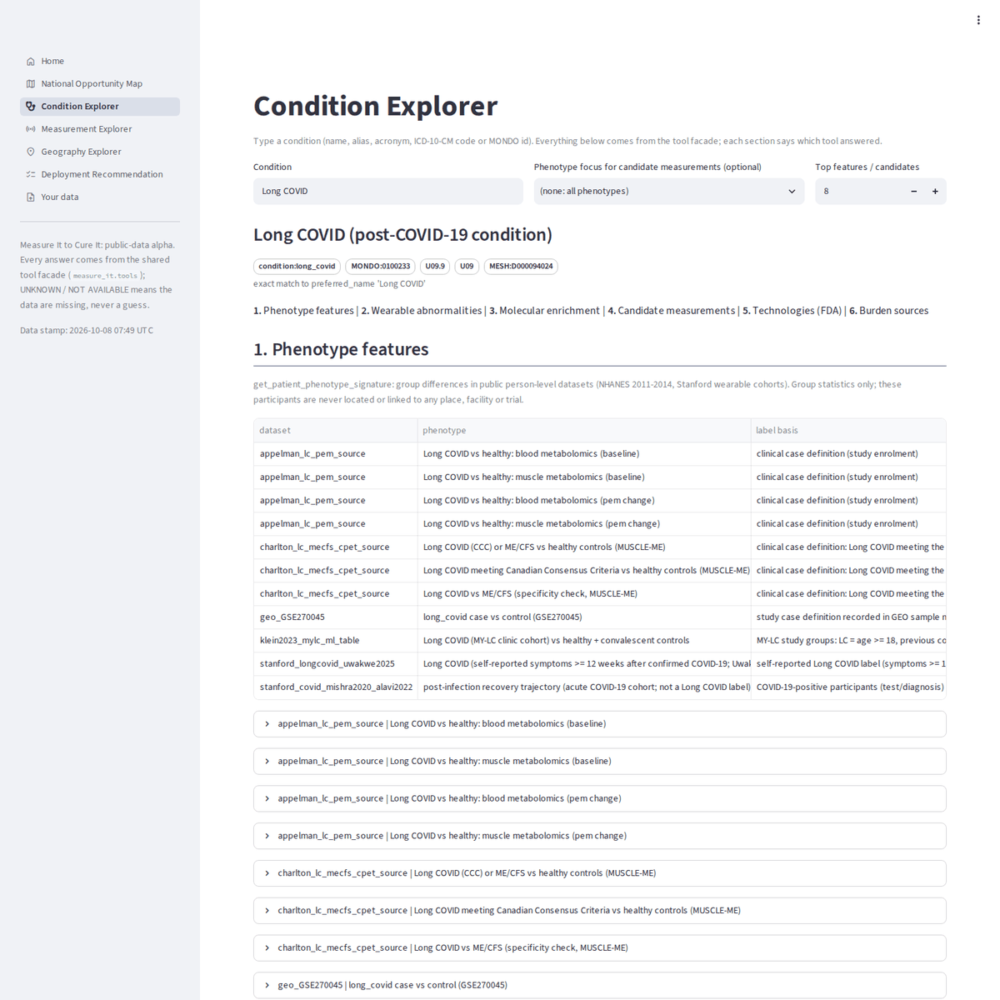 | 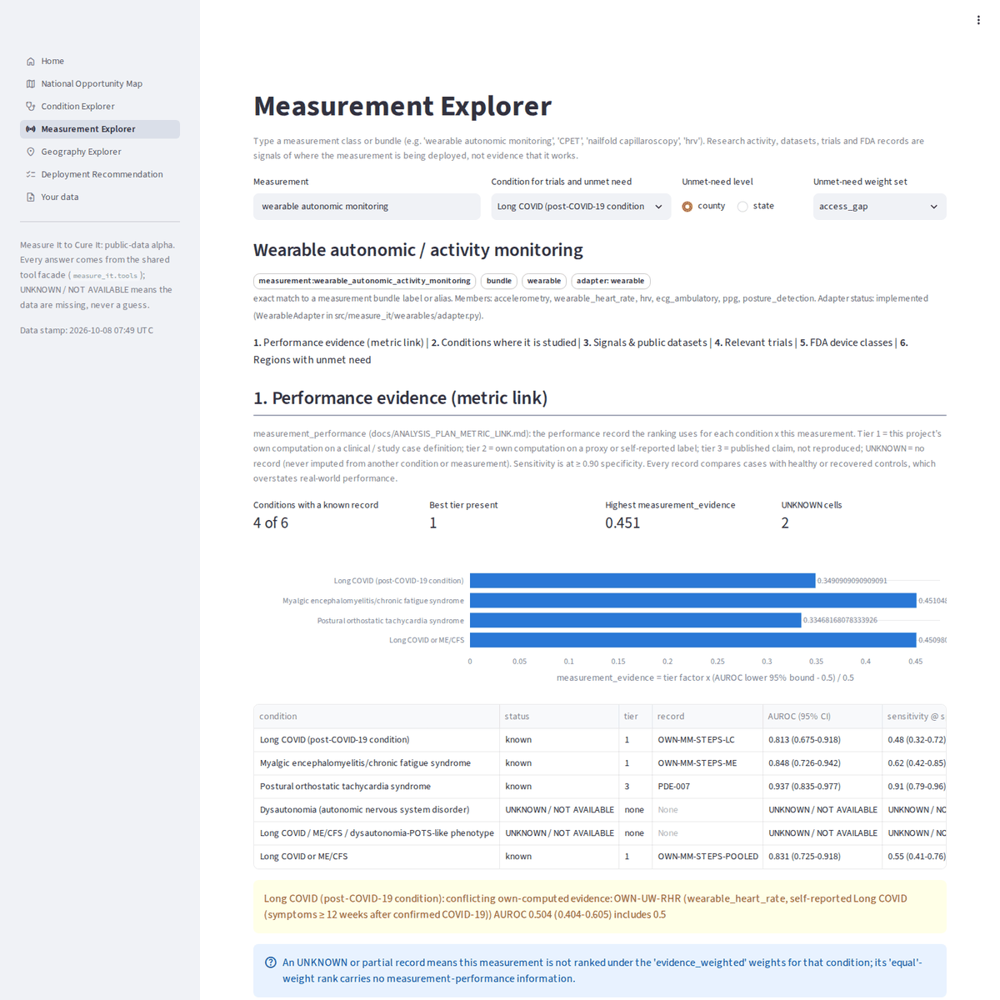 |
| **Geography Explorer** | **Deployment Recommendation** | **National Opportunity Map** |
| 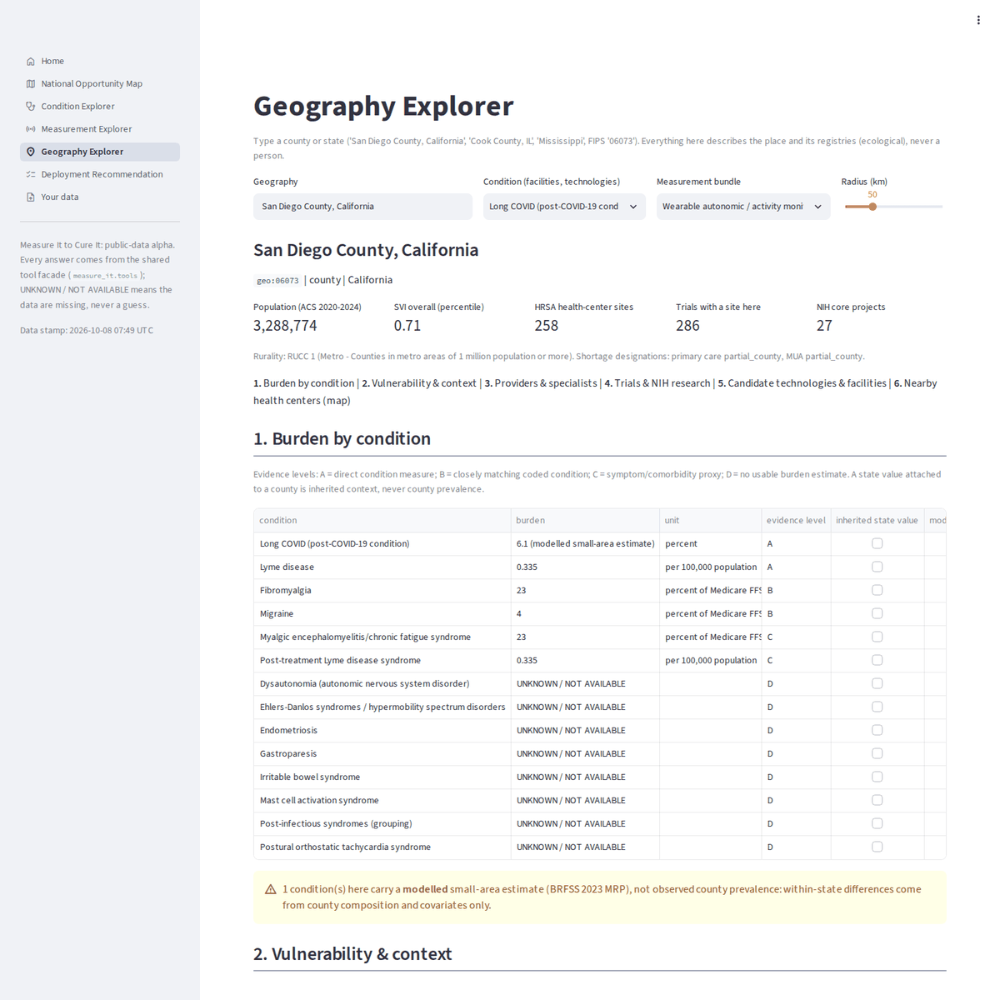 | 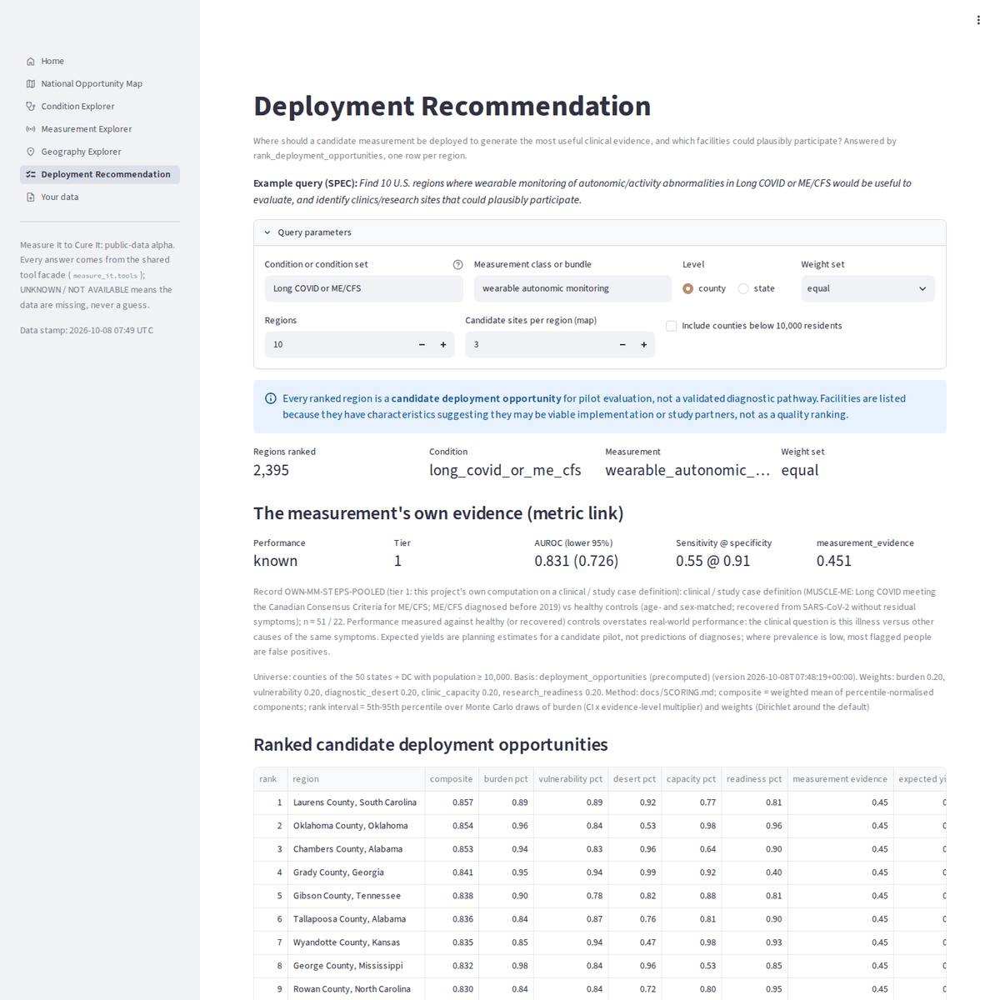 |  |

**Figures** (all ten, with captions: [visuals/figures/](visuals/figures/CAPTIONS.md)):

| System architecture | Deployment opportunities |
|---|---|
| 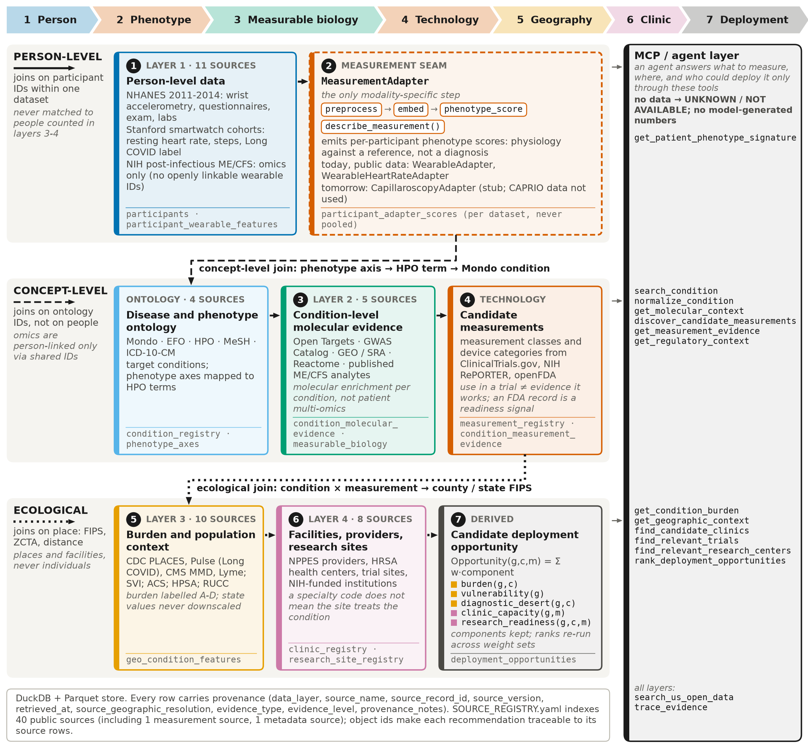 | 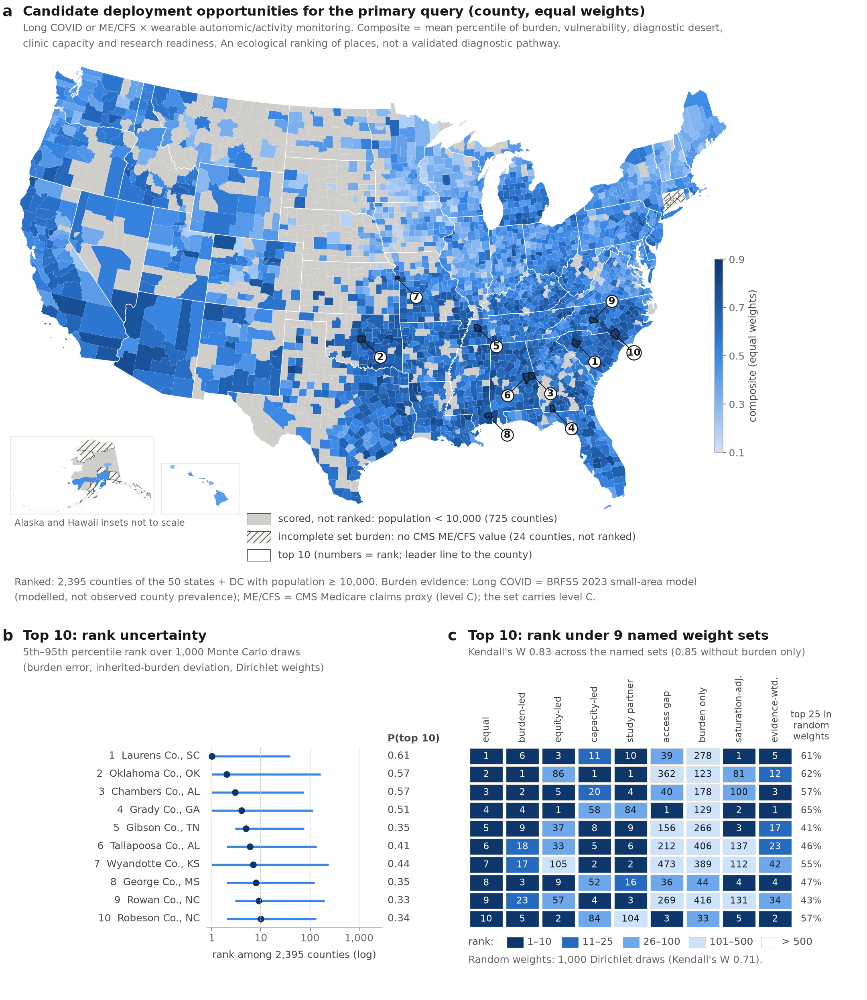 |
| **Long COVID burden and unmet need** | **Swapping the measurement (adapter modularity)** |
| 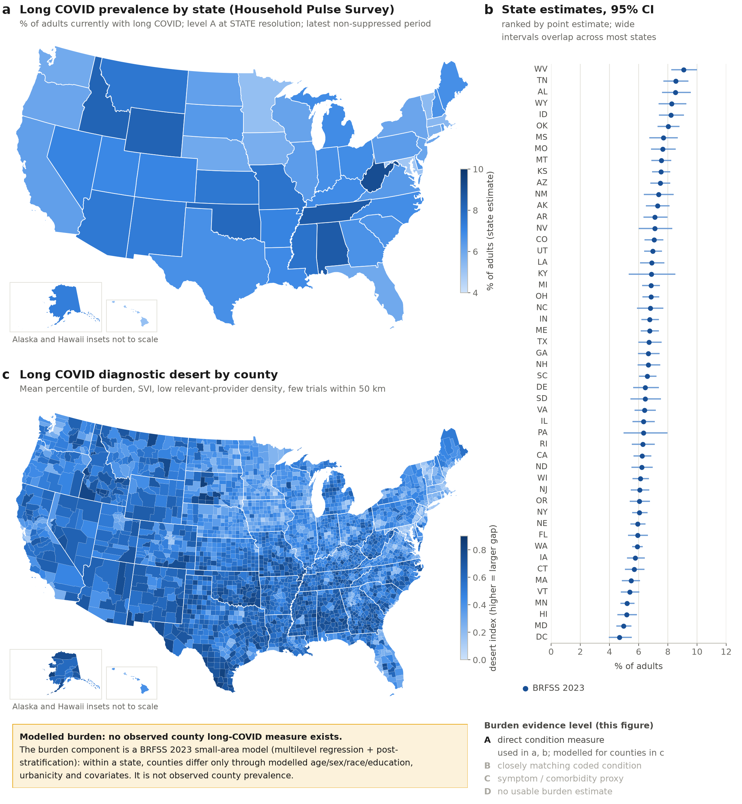 | 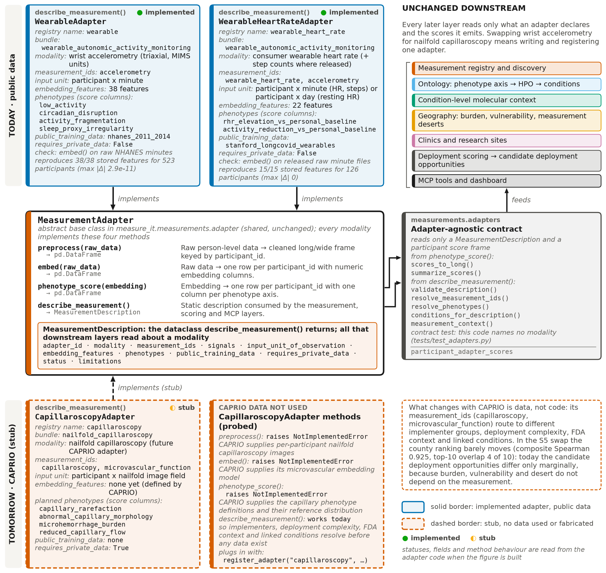 |

**Distribution.** This repository holds **code, configs, documentation, the result write-ups, the figures and the
source provenance** of the reference build. It holds **no data** and no generated tables: raw files, caches, processed
tables and result tables are rebuilt on your machine by the pipeline (below); the reference build's tables can be
attached to a release as an archive ([results/README.md](results/README.md)).

---

## Quickstart

Requirements: Python >= 3.12 and [uv](https://docs.astral.sh/uv/). Developed on Linux aarch64; CI runs the unit tests on
Linux x86_64. macOS is untested (the locked wheels resolve for Apple silicon on macOS 14+; on Intel macOS
`cryptography` has no wheel in the lock and builds from source).

**1. Code only, about a minute** (no data needed):

```bash
git clone <this repository> measure-it-public && cd measure-it-public
uv sync --frozen                                     # the environment pinned in uv.lock
uv run pytest -m "not network and not data"          # the 1,007 unit tests (what CI runs)
uv run measure-it pipeline --list                    # the 85-step DAG with entry points and dependencies
```

**2. Build the data** (network; hours; about 45 GB of disk):

```bash
uv run measure-it pipeline --workers 16              # cold build: downloads and queries every source
uv run measure-it validate                           # provenance, required datasets, person-layer geography,
                                                     # object ids, product language, data audits (exit 1 on failure)
uv run pytest -m "not network"                       # the full suite (1,654 tests) on the built tables
uv run measure-it ask "Where should we deploy wearable autonomic monitoring for Long COVID or ME/CFS?"
```

Read "Building the data" below before starting: **the cold path has never been run end to end from an empty
checkout**, and it will fetch newer data than the reference build, so its numbers will differ from `results/`.

**3. Explore** the built data: the MCP server, the HTTP API and the dashboard ("Using the engine" below), or the
containers (`uv run measure-it bundle --unpack dist/bundle && docker compose up -d --build`;
[docs/DEPLOYMENT.md](docs/DEPLOYMENT.md)).

**Guided tour:** [docs/WALKTHROUGH.md](docs/WALKTHROUGH.md). **Your own data:**
[docs/BRING_YOUR_OWN_DATA.md](docs/BRING_YOUR_OWN_DATA.md).

---

## Status and limitations

**Update (2026-10-07).** The engine now takes a private device or omics dataset (first: MAESTRO nailfold
capillaroscopy) through to people, places and clinicians: a shared ICD-10-CM / LOINC / RxNorm person vocabulary,
device-defined subgroup phenotypes (`measure-it byod subgroup`), similar-people estimates and OMOP/clinic query packs
(`measure-it byod similar`), BRFSS small-area Long COVID burden (now the default county burden) and Medicare billing
activity as clinic capacity where a measurement has a billing code (now the default), plus candidate-clinician outreach
workbooks (`python -m measure_it.outreach`, local-only). Runbook: [docs/MAESTRO_RUNBOOK.md](docs/MAESTRO_RUNBOOK.md);
interfaces: [docs/HARMONIZATION_CONTRACT.md](docs/HARMONIZATION_CONTRACT.md); effect on the ranking:
[results/STAGE_LAYERS_SCORING.md](results/STAGE_LAYERS_SCORING.md).

**Status (2026-09-24).** Every required component of the brief is built and tested (37 public sources, a
75-step offline pipeline, SPEC Tests 1-7, MCP server, API, dashboard, figures), with named gaps: mapMECFS per-participant files
are login-gated (source partial), CDC PLACES is ingested at county and ZCTA level only, dashboard page 1 shows one area
layer at a time, three of the nine demo-story steps are partial, and the optional benchmarks were not done
([results/FINAL_REPORT.md](results/FINAL_REPORT.md) §2). The infrastructure works; the public evidence for the
scientific thesis is weak: the only Long COVID label with wearable heart rate among the public datasets processed gives a null result,
the ME/CFS signal comes from a constructed proxy, burden for the demo conditions is inherited, proxy or absent, the
short list of regions is unstable under reasonable weights, and the ranking barely depends on which measurement is
deployed. Read **[results/FINAL_REPORT.md](results/FINAL_REPORT.md)** first; it lists what the alpha does and does not
demonstrate, with the source of every number.

**Beyond wearables** (FINAL_REPORT §14; every analysis under a plan locked before any group comparison, each dataset
separate, published claims kept apart from our computation). Candidates, each a group difference between *diagnosed*
people and *healthy or surgical* controls in the authors' own released rows (re-analysis, not independent replication):
MUSCLE-ME hip-accelerometer daily steps, Long COVID + ME/CFS vs healthy, AUROC 0.831 (0.725-0.918) on complete cases but
0.612 (0.459-0.763) in the locked worst case for 8 missing controls, and no better than CPET; MY-LC serum cortisol 0.963
(0.933-0.987), not reproduced in two other published cohorts; endometriosis serum ARG1 vs surgical controls 0.846
(0.762-0.918); hEDS/HSD serum Olink 0.684 (0.624-0.747). Nulls: mapMECFS person-linked omics (0 of 5 layers pass), GEO
case/control cohorts (0 of 4 primary cross-cohort transfers replicate; the one near-perfect cohort is confounded with
sample source, its case and control subject ids carrying different prefixes; the ME/CFS cfRNA signal is explained by covariates), routine NHANES labs against prescription-coded
umbrella labels (positive controls pass), 58 NHANES lab layers (1 of 47 lab-block rows supported, +0.0025, and 0 of 292 per-layer screens;
accelerometry still adds for functional limitation), Appelman 2024 metabolomics and fibromyalgia thermography (fails its primary). NHANES 2003-2006
hip accelerometry replicates 8 of 12 pre-specified wearable verdicts. No open per-person MCAS or POTS lab dataset with
controls exists, and no measurement has been tested against clinical look-alikes. Two curated tables hold 66 published
device claims and 109 published lab claims with verified quotes; `docs/DATA_ACCESS_PLAN.md` lists controlled routes (All
of Us: 68,840 people with Fitbit data; RECOVER-Adult: 6,569 with raw Fitbit streams) as counts of people with data, not
analysed here.

**Engineering limitations.** The cold build (network, empty checkout) is untested end to end; the reference numbers in
`results/` come from offline rebuilds of data fetched step by step during development. Sources that change over time
(ClinicalTrials.gov, RePORTER, openFDA, Open Targets, GWAS Catalog, GEO, NPPES, HRSA, ...) will give a new build
different numbers ([docs/REPRODUCIBILITY.md](docs/REPRODUCIBILITY.md) section 8). The build is sized for a large
workstation (reference host: 20 cores, 121 GB RAM).

No private CAPRIO/MAESTRO capillaroscopy data are used. Capillaroscopy appears only as a stub adapter that shows where
a future device plugs in.

---

## The four data layers and the guardrails

| layer | what | examples | how it may be joined |
|---|---|---|---|
| 1 person-level | participant rows from public cohorts | NHANES 2011-2014 and 2003-2006 accelerometry, Stanford smartwatch cohorts, NIH post-infectious ME/CFS omics deposits, MUSCLE-ME steps/CPET, released lab, proteomics and GEO case/control tables | only on the dataset's own participant id (`nhanes:<SEQN>`, ...); datasets are never pooled; no location columns |
| 2 condition-level molecular | genes, variants, pathways, studies attached to a disease concept | Open Targets, GWAS Catalog, GEO/SRA, Reactome, published lab-evidence claims | through ontology ids, never through people ("condition-level molecular enrichment", not patient multi-omics) |
| 3 population / geographic | burden, vulnerability, context for places | CDC BRFSS (Long COVID small-area model, labelled modelled), Household Pulse (state, alternate), PLACES, CMS MMD, Lyme surveillance, SVI, ACS | ecological joins on FIPS / ZCTA; state values are never downscaled to counties; modelled county estimates are labelled as models |
| 4 facility / provider / research | places that could implement or study a measurement | NPPES, HRSA, ClinicalTrials.gov sites, NIH RePORTER, openFDA, Medicare billing (Part B) and Part D prescribing by clinician | on place and distance; a specialty code or a billed code does not mean a facility treats the condition |

Enforced in code and checked by `uv run measure-it validate` and the tests:

* A participant is never presented as the same person as anyone in layers 3 or 4; `trace_evidence` refuses participant ids.
* Every processed table carries provenance columns (`source_name`, `source_record_id`, `source_version`, `retrieved_at`,
  `source_geographic_resolution`, `evidence_type`, `evidence_level`, `provenance_notes`, `data_layer`).
* Every burden value carries an evidence level: A direct measure, B closely matching coded condition, C
  symptom/comorbidity proxy, D no usable estimate (value null, never imputed). A state value attached to a county is
  flagged `inherited` with source resolution `state`; a modelled small-area value carries `estimate_kind =
  modeled_small_area` and says so wherever it is shown.
* Every score exposes its components; rankings are re-run under 8 weight sets and 1,000 Monte Carlo draws.
* A trial or grant is a research-activity signal and an FDA record a deployment-readiness signal; neither is evidence
  that a measurement works or diagnoses anything.
* No language-model-generated number is data. Tools return `UNKNOWN / NOT AVAILABLE` with a reason when data are
  missing. The `ask` agent uses no language model.
* Product language: candidate, evidence-supported, measurable phenotype, deployment opportunity, measurement desert,
  research readiness.

Details: [docs/CONVENTIONS.md](docs/CONVENTIONS.md) section 3 and [docs/GUARDRAIL_AUDIT.md](docs/GUARDRAIL_AUDIT.md).

---

## Building the data

A `git clone` holds code, configs, the write-ups and their figures, and the source provenance (`SOURCE_REGISTRY.yaml`,
`data/SOURCE_AUDITS.md`, `data/SOURCE_MANIFESTS.json`), but **no data** and no generated tables (`results/README.md`): `data/raw`
(40 GB), `data/_http_cache` (0.55 GB), the derived caches in `data/interim` (2.6 GB) and the processed Parquet tables
and DuckDB (1.7 GB) are not in git. Until the pipeline has run, `validate`, `build-db`, `ask`, the API, the dashboard,
the MCP server and the data tests have nothing to read (`ask` then says so in one line; the API reports `degraded`).

```bash
# fresh clone: build everything from the network
uv run measure-it pipeline --workers 16

# a checkout that already holds data/raw, data/_http_cache and data/interim: rebuild without any network access
uv run measure-it pipeline --offline --workers 16
```

**Offline vs cold start.** `--offline` refuses any network access and answers from `data/raw`, `data/_http_cache` and
the derived caches in `data/interim` (each rebuilt from `data/raw` when absent). Without `--offline` the same steps
download and query every source, cache the responses, and later runs can be offline. On a fresh clone every source
needs the network once; an offline run there fails at the first step with `OfflineCacheMiss` and says to run without
`--offline`. No API key is needed.

| item | what is known |
|---|---|
| status | **the cold path (empty checkout, network) has not been run end to end.** Every recorded run is offline ([docs/REPRODUCIBILITY.md](docs/REPRODUCIBILITY.md)); the per-source downloads were made step by step while the build was developed. A cold build will fetch newer data and produce different numbers (section 8 there); mapMECFS per-participant files stay login-gated |
| command | `uv run measure-it pipeline --workers 16` (keep `--workers 16`: the default is 1 worker, and the NHANES and Stanford model steps, about 80 min each at 6 workers, would take much longer; the 1-worker time was not measured) |
| host used | Linux aarch64, 20 cores, 121 GB RAM |
| memory | not measured for a cold build (the largest inputs are the 11.7 GB NPPES CSV and NHANES PAXMIN minute files of 8-9 GB per cycle). In the full 75-step offline run `20260925T194852Z` the largest single step peaked at 18.2 GB RSS (`max_rss_mb` in `results/pipeline_runs/<run id>.jsonl`); during an earlier offline rebuild the whole host's memory in use peaked at 23.1 GB |
| disk | about 45 GB (raw 40 GB, HTTP cache 0.55 GB, derived caches 2.6 GB, processed about 2 GB) |
| time | full 75-step offline rebuild with 16 workers: 2 h 56 min (run `20260925T194852Z`, reusing `data/interim`; the DAG has since grown to 85 steps, and the ten added steps were run individually with `--only`, not yet in a full rebuild); a cold build adds about 40 GB of downloads and rate-limited API traffic (not timed) |
| services and limits | agency downloads (CDC, CMS, Census, HRSA, USDA, NCHS, NUCC, HGNC, Stanford, NIH); APIs: ClinicalTrials.gov, NIH RePORTER (at most 1 request/s), openFDA (anonymous limit 1,000 requests/day; the build used 588 calls), Open Targets, GWAS Catalog, EMBL-EBI OLS, NCBI E-utilities, Data.gov (10-second crawl delay). A Data.gov outage or rate limit is recorded as a `blocked`/`partial` source and does not stop the build |

When a step fails, the pipeline prints the step's last error line and its log path
(`results/pipeline_runs/<run id>/<step>.log`). Partial rebuilds: `--only <step>` (repeatable) or `--from <step>` (that
step and everything after it), e.g. `uv run measure-it pipeline --offline --from scoring_report`.
`uv run measure-it build-db` rebuilds `data/processed/measure_it_public.duckdb` (every table plus the SPEC core-data-model
views `spec.*`; it exits non-zero when a SPEC view has no underlying table). Test markers: `-m data` needs
`data/processed`, `-m network` would call a live API (none currently does; Data.gov calls in tests run from the HTTP
cache).

---

## Using the engine

**Ask a question** (deterministic, LLM-free; every sentence cites object ids):

```bash
uv run measure-it ask "Where should we deploy wearable autonomic monitoring for Long COVID or ME/CFS?"
uv run measure-it ask "Given phenotype orthostatic intolerance and candidate measurement technology nailfold capillaroscopy, where should we deploy it?"
uv run measure-it ask --json "Where should we deploy autonomic testing for POTS?"    # parse, tool calls, cited ids
```

Rankings are national: there is no state filter, so "... in California?" gets the national county ranking, with the
state's counties among the national top 50 listed separately and a within-state ranking reported as UNKNOWN.
`--json` prints only JSON on stdout (progress goes to stderr).

**MCP server** (FastMCP, stdio, 18 read-only tools, 2 prompts, 4 resources):

```bash
uv run measure-it serve-mcp                          # .mcp.json already declares it for Claude Code
```

Set `MEASURE_IT_OFFLINE=1` in the server's environment to answer from local data only (then `search_us_open_data`
answers only the catalog queries already in the HTTP cache, matched ignoring case and spacing). A default
`rank_deployment_opportunities` call (top 10) returns about 90 kB of JSON, which can exceed Claude Code's default MCP
output limit (`MAX_MCP_OUTPUT_TOKENS`, 25,000 tokens); start Claude Code with `MAX_MCP_OUTPUT_TOKENS=50000` or ask for
`top_n=5`. Claude Desktop configuration, the tool list and real example calls: [docs/MCP.md](docs/MCP.md).

**HTTP API and dashboard:**

```bash
uv run measure-it serve-api --offline                # http://127.0.0.1:8000, OpenAPI docs at /docs
uv run measure-it dashboard --offline --headless     # http://localhost:8501 (home + 6 pages; 6 = Your data)
```

Both bind to 127.0.0.1 by default (`--host 0.0.0.0` exposes them on the network). The dashboard runs headless whenever
stdin is not a terminal (nohup, CI, ssh without a TTY); without `--headless` in a terminal, Streamlit's first run may
ask for an e-mail address (press Enter to skip). `measure-it dashboard` replaces itself with the Streamlit server, so
Ctrl-C or `kill <pid>` (the pid it prints) stops the server itself.

Pages: National Opportunity Map, Condition Explorer, Measurement Explorer, Geography Explorer, Deployment
Recommendation, Your data ([docs/DASHBOARD.md](docs/DASHBOARD.md); screenshots in `visuals/dashboard/`). Page 1 shows one
area layer at a time (opportunity, desert or burden) with independently toggled point overlays.

**Containers** (code-only image; the data you built are packed with `measure-it bundle` and mounted read-only; the
single-page reviewer snapshot is `measure-it export-static`, published as `dashboard.html`): [docs/DEPLOYMENT.md](docs/DEPLOYMENT.md).

**Python:**

```python
from measure_it import tools
r = tools.rank_deployment_opportunities("Long COVID or ME/CFS", "wearable autonomic monitoring", "county", top_n=10)
print(r["status"], r["data"]["recommendations"][0]["geography"]["name"])
print(tools.trace_evidence("geo:06073")["data"]["sources"][0]["source_id"])
```

---

## Repository map

```text
README.md, dashboard.html   this page; the read-only dashboard snapshot (`measure-it export-static`)
visuals/                    dashboard screenshots and Figures 1-10 with captions (published copies)
SOURCE_REGISTRY.yaml        the 40 public sources (merged from data/raw/*/registry_entry.yaml by `measure-it merge-registry`)
configs/                    curated assumptions: conditions, measurement classes and audited text patterns,
                            relevance (condition specialties, measurement implementers, bundles), scoring weights and
                            Monte Carlo settings, FDA product-code map, GEO queries, specialty groups
data/raw/<source_id>/       raw files + DATA_AUDIT.md, MANIFEST.json, registry_entry.yaml (not in git; gathered into
                            data/SOURCE_AUDITS.md and data/SOURCE_MANIFESTS.json, which are)
data/_http_cache/           cached API responses (not in git)
data/interim/               derived caches (not in git)
data/processed/             Parquet tables + .meta.json sidecars; measure_it_public.duckdb (not in git)
docs/                       brief (SPEC.md), conventions, analysis plans (written before each analysis), method docs, audits
results/                    FINAL_REPORT.md and per-analysis write-ups (in git); tables/, figures/, maps/,
                            pipeline_runs/ (regenerated; see results/README.md)
dashboard/                  Streamlit app: app.py (home), pages/1-6, components/, screenshots.py
src/measure_it/
  config.py http.py download.py provenance.py store.py registry.py   shared infrastructure (paths, cached HTTP, provenance)
  pipeline.py cli.py database.py validate.py reproduce.py            DAG, CLI, DuckDB build, checks, run comparison
  ingestion/        one module per public source (NHANES, Stanford, mapMECFS, CDC, CMS, ACS, SVI, HRSA, NPPES, ...)
  ontology/         condition registry (Mondo, EFO, MeSH, HPO, ICD-10-CM) and the condition normaliser
  omics/            Open Targets, GWAS Catalog, GEO/SRA, Reactome/HGNC reference data, Test 3, measurable-biology graph,
                    person-linked mapMECFS omics, GEO case/control cohorts
  labs/             labs vs diagnosis, Appelman metabolomics, lab dataset discovery and its three analyses, published
                    lab evidence, All of Us lab-concept counts
  wearables/        NHANES and Stanford features and models, signatures, clustering, digital person, WearableAdapter,
                    NHANES lab layers, NHANES 2003-2006, MUSCLE-ME steps, fibromyalgia thermography
  measurements/     MeasurementAdapter interface, adapter registry, capillaroscopy stub, measurement discovery,
                    precision audit, Phase 3 evidence, FDA regulatory mapping, measurement resolver, device dataset
                    discovery, published device evidence
  geography/        ZIP/ZCTA/county crosswalk, burden and context features, diagnostic desert, Tests 4 and 6, queries
  facilities/       facility registry and entity resolution, find_candidate_clinics, research centres, Test 6 shuffle
  scoring/          deployment opportunities, Tests 5-7 and sensitivity analyses, recommendations, report
  figures/          Figures 1, 2, 10 (schematics) and 3-9 (data), interactive maps
  tools.py          the tool facade shared by the MCP server, the API, the dashboard and the agent
  mcp/              FastMCP server, trace_evidence
  api/              FastAPI app and GeoJSON boundaries
  agents/           deterministic deployment agent, Data.gov discovery (search_us_open_data)
tests/              pytest suite
.github/            CI (unit tests without data, repository hygiene, Docker build), issue and PR templates
```

## Where results live

| what | where |
|---|---|
| Final report (start here) | [results/FINAL_REPORT.md](results/FINAL_REPORT.md) |
| Wearable phenotype models (NHANES; Stanford) | [results/WEARABLE_NHANES_RESULTS.md](results/WEARABLE_NHANES_RESULTS.md), [results/WEARABLE_STANFORD_RESULTS.md](results/WEARABLE_STANFORD_RESULTS.md) |
| Measurement discovery; Phase 3 evidence | [results/MEASUREMENT_DISCOVERY.md](results/MEASUREMENT_DISCOVERY.md), [results/PHASE3_MEASUREMENT_EVIDENCE.md](results/PHASE3_MEASUREMENT_EVIDENCE.md) |
| Molecular coherence (Test 3) | [results/MOLECULAR_COHERENCE.md](results/MOLECULAR_COHERENCE.md) |
| Geography (Test 4, geography Test 6) | [results/GEOGRAPHY_RESULTS.md](results/GEOGRAPHY_RESULTS.md) |
| NHANES 2003-2006 replication; NHANES lab layers | [results/NHANES_2003_2006_RESULTS.md](results/NHANES_2003_2006_RESULTS.md), [results/NHANES_LAYERS_RESULTS.md](results/NHANES_LAYERS_RESULTS.md) |
| Person-linked omics (mapMECFS); GEO case/control cohorts | [results/LINKED_OMICS_RESULTS.md](results/LINKED_OMICS_RESULTS.md); `results/tables/geo_cohort_*.csv` (no write-up file yet) |
| Other devices (MUSCLE-ME steps and CPET; fibromyalgia thermography) | [results/CHARLTON_LC_MECFS_CPET_SOURCE_RESULTS.md](results/CHARLTON_LC_MECFS_CPET_SOURCE_RESULTS.md), [results/FM_THERMOGRAPHY_RESULTS.md](results/FM_THERMOGRAPHY_RESULTS.md) |
| Labs (NHANES labs vs diagnosis, Appelman metabolomics; MY-LC cortisol; endometriosis ARG1; hEDS/HSD Olink) | [results/LABS_VS_DIAGNOSIS_RESULTS.md](results/LABS_VS_DIAGNOSIS_RESULTS.md), [results/KLEIN2023_MYLC_ML_TABLE_RESULTS.md](results/KLEIN2023_MYLC_ML_TABLE_RESULTS.md), [results/ENDO_ARG1_REPOD_RESULTS.md](results/ENDO_ARG1_REPOD_RESULTS.md), [results/HEDS_HSD_OLINK_SERUM_CINQUINA2026_RESULTS.md](results/HEDS_HSD_OLINK_SERUM_CINQUINA2026_RESULTS.md) |
| Scoring and deployment (Tests 5-7) | [results/SCORING_RESULTS.md](results/SCORING_RESULTS.md), `results/example_deployment_recommendation.json` |
| Result tables (CSV) | `results/tables/` after a build ([results/README.md](results/README.md)) |
| Figures 1-10 and captions; dashboard screenshots | [visuals/figures/CAPTIONS.md](visuals/figures/CAPTIONS.md), `visuals/dashboard/`; the pipeline writes figures to `results/figures/` and interactive maps to `results/maps/` |
| Pipeline run logs | `results/pipeline_runs/` after a build |
| Processed tables and DuckDB (after a build) | `data/processed/` (the 11 SPEC datasets, e.g. `deployment_opportunities.parquet`, `measure_it_public.duckdb`) |

---

## Launch agent (any dataset -> candidate launch sites)

`uv run measure-it launch run <input> --condition long_covid --measurement nailfold_capillaroscopy --approve` takes a
dataset in (almost) any format (REDCap export + dictionary, CSV/Excel/Parquet/SAS/SPSS/Stata, OMOP, FHIR), proposes a
human-reviewed mapping, writes a BYOD folder and an All of Us-shaped OMOP export, runs the engine's layers (evaluate,
device subgroup, similar people, subgroup burden) and returns ranked, traceable candidate launch counties with the
clinicians and sites to contact, then removes the dataset from the engine again. No language model is contacted unless
`--llm claude`, and none ever produces a number. See [docs/LAUNCH_AGENT.md](docs/LAUNCH_AGENT.md) and
[docs/AGENT_CONTRACT.md](docs/AGENT_CONTRACT.md).

---

## Bringing your own data

To run your own measurements (a new device, a lab panel, a local cohort) through the engine without putting them in
this repository, follow [docs/BRING_YOUR_OWN_DATA.md](docs/BRING_YOUR_OWN_DATA.md); [docs/WALKTHROUGH.md](docs/WALKTHROUGH.md)
walks through a complete example. Private data stay on your machine; only group-level results should reach public
outputs.

Outside groups can evaluate their own de-identified person-level data (device or tool measurements, EHR labs (LOINC)
and diagnoses (ICD-10-CM), omics layers) and see how a measurement's performance record moves the deployment ranking,
without editing core code:

    uv run measure-it byod validate <folder>   # refuses identifying / geographic content, lists every reason
    uv run measure-it byod ingest   <folder>   # namespaced person-layer partitions, provenance, DATA_AUDIT.md
    uv run measure-it byod evaluate <folder>   # locks the pre-specified analysis (sha256), then CV / bootstrap / permutation
    uv run measure-it byod deploy   <folder>   # metric link + evidence_weighted re-scoring; reports how the ranking moved
    uv run measure-it byod remove   <id>       # removes everything; rankings return to the public-data build

Only one aggregate performance record per dataset reaches the ranking (tier `user_supplied_own_computation`, 2.5,
between this project's own public-data computations and published claims); person rows never carry geography.
De-identification, IRB / data-use permission and any sharing of results remain the data owner's responsibility.
Start from the template folder `templates/byod/`; `examples/byod_synthetic/make_example.py` builds a SYNTHETIC dataset
for practice (excluded from rankings unless `--demo`). Remove user datasets before a pipeline run whose outputs will be
committed.

### Adding a measurement modality (a new `MeasurementAdapter`, e.g. CAPRIO)

Only the first step of the chain depends on the measurement modality. It sits behind one interface
(`src/measure_it/measurements/adapter.py`); every later layer reads only the adapter's `describe_measurement()` and the
per-participant scores it emits.

```python
from measure_it.measurements.adapter import MeasurementAdapter, MeasurementDescription

class CaprioCapillaroscopyAdapter(MeasurementAdapter):
    def preprocess(self, raw_data): ...          # nailfold images + metadata -> QC'd fields keyed by participant_id
    def embed(self, raw_data): ...               # -> one row per participant_id, numeric microvascular embedding
    def phenotype_score(self, embedding): ...    # -> one column per capillary phenotype, against a healthy reference
    def describe_measurement(self) -> MeasurementDescription: ...   # measurement_ids from configs/measurements.yaml

from measure_it.measurements.adapters import register_adapter, adapter_for_bundle, measurement_context, scores_to_long
register_adapter("capillaroscopy", CaprioCapillaroscopyAdapter, overwrite=True)
adapter = adapter_for_bundle("nailfold capillaroscopy")        # configs/relevance.yaml already routes this bundle
ctx = measurement_context(adapter.describe_measurement())      # implementers, deployment complexity, FDA, conditions
scores = scores_to_long(adapter.describe_measurement(), adapter.phenotype_score(adapter.embed(images)), "caprio_study")
```

Steps:

1. Implement the four methods. `participant_id` is namespaced `<dataset_id>:<native id>`; `measurement_ids` must exist
   in `configs/measurements.yaml` (`capillaroscopy` and `microvascular_function` already do); keep score components as
   `<phenotype>__*` columns.
2. Replace the stub by registering the adapter under the name `capillaroscopy` (the `nailfold_capillaroscopy` bundle
   already names it). The stub (`src/measure_it/measurements/capillaroscopy_adapter.py`) documents exactly what CAPRIO
   must supply.
3. Give each phenotype an ontology hook: a `phenotype_axes` row with an HPO term, or a declared link to an existing
   axis. Until then its condition links resolve to UNKNOWN; none is invented.
4. Add a pipeline `Step` (`measure_it.pipeline.STEPS`) that runs the adapter and writes
   `participant_adapter_scores__<dataset>`, then rebuild downstream (`uv run measure-it pipeline --offline --from
   measurement_adapters`).
5. Validate: `uv run pytest tests/test_adapters.py` (the contract test runs a synthetic adapter through every downstream
   function) plus the adapter's own reproduction checks, as `results/tables/wearable_adapter_validation.csv` does for
   the wearable adapter.

Nothing downstream is rewritten: registry, ontology, molecular layer, geography, clinic matching, scoring, MCP tools and
dashboard stay the same; only the measurement ids change. The `nailfold_capillaroscopy` bundle already runs through
the identical scoring path today, and with today's public data its county ranking is almost the same as the wearable
bundle's (composite Spearman 0.994, top-10 overlap 9 of 10; `results/tables/test7_sensitivity_comparisons.csv`):
until a measurement brings its own person-level evidence, implementers and research activity, the deployment list
barely depends on which measurement is deployed. Private data must stay outside
this repository; a private adapter declares `requires_private_data = True`, and only group-level results should reach
public outputs. Full contract: [docs/ADAPTERS.md](docs/ADAPTERS.md).

---

## Data licences and access notes

The code's licence (below) does not cover the data. Every source's licence, access conditions, retrieval date and
limitations are in `SOURCE_REGISTRY.yaml` and [data/SOURCE_AUDITS.md](data/SOURCE_AUDITS.md);
**[docs/DATA_LICENSES.md](docs/DATA_LICENSES.md)** tabulates, per source, the licence, whether derived tables may be
redistributed, and the attribution each provider asks for. Obligations that matter when you build and reuse the data:

* **NHANES** (CDC NCHS): the NCHS Data User Agreement allows statistical analysis only; make no attempt to identify
  any person and do not link the data with individually identifiable data from other datasets.
* **Stanford smartwatch cohorts**: Uwakwe 2025 is ODC-By 1.0 with an SDR use statement (do not use to identify
  individuals); the Mishra 2020 and Alavi 2022 downloads carry no data licence (public links in the papers only).
* **ClinicalTrials.gov**: NLM asks for the credit line "Courtesy of the U.S. National Library of Medicine", no implied
  endorsement, and disclosure when redistributed data are not current.
* **Journal supplements** (MUSCLE-ME, Appelman 2024, MY-LC, fibromyalgia thermography, the NIH ME/CFS article and its
  Pennsieve deposit) are CC BY 4.0: cite the article. The **hEDS/HSD Olink** article (Cinquina 2026) is **CC BY-NC-ND
  4.0** (non-commercial, no derivatives), not CC BY as the source registry still says. **mapMECFS** per-participant
  files need a registered account under a data-use agreement that forbids redistribution, and were not used.
* **U.S. government sources** (CDC, CMS, Census, HRSA, USDA ERS, NIH RePORTER, NPPES) are public domain or FOIA-public;
  **openFDA, Open Targets, HGNC, DOID and Reactome data** are CC0; **Mondo and ORDO** CC BY 4.0; **HPO** has its own
  licence (cite it with its version; its content may not be altered); GWAS Catalog and OLS follow the EMBL-EBI terms of
  use; the **NUCC taxonomy** is AMA-copyrighted and may not be modified or redistributed as a derivative work.
* The **published device and lab evidence** tables hold short verbatim quotes; copyright in the articles stays with
  the publishers.

---

## Documentation

| document | contents |
|---|---|
| [docs/WALKTHROUGH.md](docs/WALKTHROUGH.md) | guided tour of a build and a query |
| [docs/BRING_YOUR_OWN_DATA.md](docs/BRING_YOUR_OWN_DATA.md) | running your own measurements through the engine |
| [docs/SPEC.md](docs/SPEC.md) | the project brief: guardrails, validation tests, success criteria |
| [docs/CONVENTIONS.md](docs/CONVENTIONS.md) | build conventions, guardrails in code, geography rules, object ids |
| [docs/SPEC_COMPLIANCE.md](docs/SPEC_COMPLIANCE.md) | requirement-by-requirement compliance audit (a snapshot taken before the final report; current status: FINAL_REPORT §2 and §21) |
| [docs/GUARDRAIL_AUDIT.md](docs/GUARDRAIL_AUDIT.md) | adversarial audit of the scientific guardrails and product language |
| [docs/REPRODUCIBILITY.md](docs/REPRODUCIBILITY.md) | offline rebuild, timings, determinism results, cold-cache network use |
| [docs/DEPLOYMENT.md](docs/DEPLOYMENT.md) | containers, the data bundle you build locally, the static reviewer snapshot |
| [docs/DATA_LICENSES.md](docs/DATA_LICENSES.md) | per-source licence, redistribution verdict and required attribution |
| [docs/MAP_MECFS_LINKAGE_AUDIT.md](docs/MAP_MECFS_LINKAGE_AUDIT.md) | participant-linkage audit of the NIH post-infectious ME/CFS deposits |
| [docs/BURDEN_DEFINITIONS.md](docs/BURDEN_DEFINITIONS.md) | burden evidence levels A-D, primary measures, proxy map, inheritance rule |
| [docs/SCORING.md](docs/SCORING.md) | deployment-opportunity components, formula, weights, Monte Carlo, Tests 5-7 |
| [docs/FACILITY_MATCHING.md](docs/FACILITY_MATCHING.md) | facility registries, entity resolution, clinic matching, clinic-location shuffle |
| [docs/ADAPTERS.md](docs/ADAPTERS.md) | the MeasurementAdapter contract, the wearable adapters, the CAPRIO stub |
| [docs/MCP.md](docs/MCP.md) | tool facade, MCP server, trace_evidence, the deterministic agent, real example calls |
| [docs/DASHBOARD.md](docs/DASHBOARD.md) | FastAPI routes and the six dashboard pages |
| `docs/ANALYSIS_PLAN_*.md` | analysis plans written before each analysis, with dated deviations |
| [docs/DEVICE_DATASET_DISCOVERY.md](docs/DEVICE_DATASET_DISCOVERY.md), [docs/LAB_DATASET_DISCOVERY.md](docs/LAB_DATASET_DISCOVERY.md) | verified, ranked open person-level device (90) and lab (182) dataset candidates, with the primaries locked before analysis |
| [docs/PUBLISHED_DEVICE_EVIDENCE.md](docs/PUBLISHED_DEVICE_EVIDENCE.md), [docs/PUBLISHED_LAB_EVIDENCE.md](docs/PUBLISHED_LAB_EVIDENCE.md) | 66 published device claims and 109 published lab claims, quotes verified against Europe PMC; published claims, not reproduced |
| [docs/DATA_ACCESS_PLAN.md](docs/DATA_ACCESS_PLAN.md) | Snyder-lab releases and controlled cohorts (All of Us, RECOVER, UK Biobank, ...): counts of people with data or tests, access routes |
| [data/SOURCE_AUDITS.md](data/SOURCE_AUDITS.md), [data/SOURCE_MANIFESTS.json](data/SOURCE_MANIFESTS.json) | one audit per source (40), and every download's URL and sha256 |
| [docs/LAUNCH_AGENT.md](docs/LAUNCH_AGENT.md), [docs/AGENT_CONTRACT.md](docs/AGENT_CONTRACT.md) | the launch agent: usage, and its privacy and language-model boundaries |
| [docs/MAESTRO_RUNBOOK.md](docs/MAESTRO_RUNBOOK.md), [docs/HARMONIZATION_CONTRACT.md](docs/HARMONIZATION_CONTRACT.md) | running a private device study (first: MAESTRO capillaroscopy) through the engine |

---

## Contributing, security, citation, licence

* **Contributing:** [CONTRIBUTING.md](CONTRIBUTING.md) (adding a source, an adapter or a condition; the guardrails a
  contribution must keep; tests and `validate`). Participation follows the [code of conduct](CODE_OF_CONDUCT.md).
* **Security and privacy:** [SECURITY.md](SECURITY.md). Never put personal health information in an issue.
* **Citation:** no paper or archived release yet. Until there is one, cite the repository and the commit you used:
  *Measure It to Cure It: a public-data-only invisible-illness measurement-validation and deployment engine
  (measure-it-public), version 0.1.0, commit `<hash>`, <repository URL>.* Also cite the data sources you rely on
  ([docs/DATA_LICENSES.md](docs/DATA_LICENSES.md)).
* **Licence:** the code is released under the [MIT License](LICENSE). The licence covers the code and documentation
  written for this project, not the third-party data: raw and processed data, and the derived tables and figures under
  `results/`, remain subject to their sources' terms ([docs/DATA_LICENSES.md](docs/DATA_LICENSES.md)).
